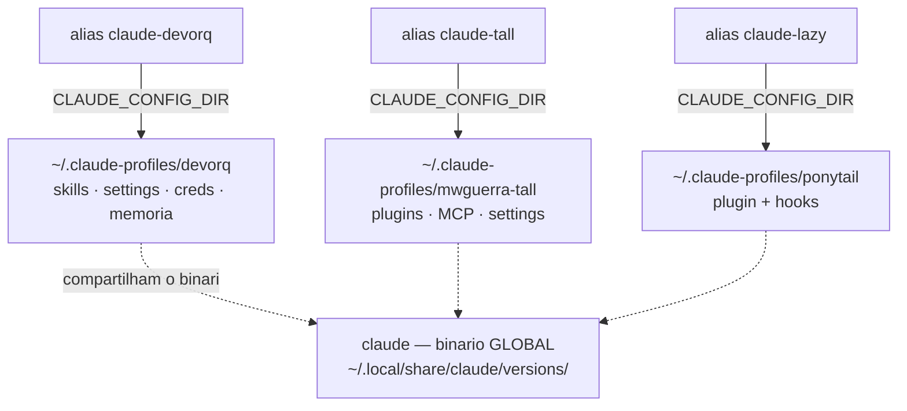
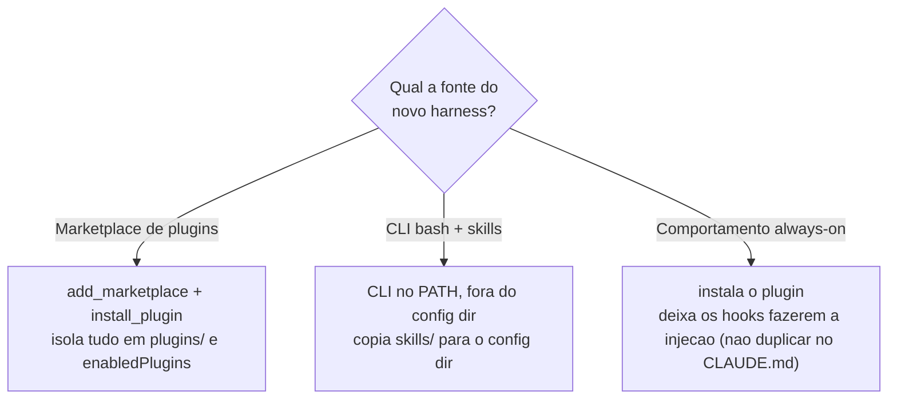

# claude-profiles — crie seus harnesses isolados do Claude Code

Um sistema para montar **harnesses isolados** do Claude Code, no estilo `codex --profile <nome>` —
cada profile é um `~/.claude-profiles/<nome>` próprio (skills, agents, hooks, plugins, MCP, settings,
memória e credenciais isolados), ativado por `CLAUDE_CONFIG_DIR` + um alias zsh. Três exemplos prontos
acompanham o repo; **[crie o seu](#adicionar-um-novo-harness)** copiando o padrão que combina com a sua fonte.

> 🧩 **Visão geral visual:** **[nandinhos.github.io/claude-profiles](https://nandinhos.github.io/claude-profiles/)** — infográfico dos 3 profiles, do mecanismo de isolamento e da timeline de versão (servido via GitHub Pages a partir de `docs/`).

> Este README é a **fonte viva**. O **mecanismo** (verificado empiricamente) e o **plano/decisões**
> estão em [`HANDOFF.md`](HANDOFF.md) e [`PLANO.md`](PLANO.md) — **históricos congelados** (2026-06-29),
> mantidos como referência do "porquê". Versões pinadas em [`VERSIONS.md`](VERSIONS.md).

## Exemplos inclusos — e os 3 padrões que ensinam

Cada exemplo é também um **padrão de fonte** que você copia para o seu profile (ver
[Adicionar um novo harness](#adicionar-um-novo-harness)):

| Alias | `~/.claude-profiles/` | Padrão de fonte | Fonte | Para quê |
|---|---|---|---|---|
| `claude-devorq` | `devorq` | **CLI + skills** | [devorq](https://github.com/nandinhos/devorq) | metodologia/disciplina (gates, scope-guard, lições, commit-hook) |
| `claude-tall` | `mwguerra-tall` | **marketplace** | [mwguerra/claude-code-plugins](https://github.com/mwguerra/claude-code-plugins) + `laravel@mwguerra-plugins` | stack Laravel/TALL · **Filament v5** · Pest · Reverb · Docker |
| `claude-lazy` | `ponytail` | **hooks always-on** | [DietrichGebert/ponytail](https://github.com/DietrichGebert/ponytail) | código mínimo / anti-over-engineering |

## Modelo de isolamento

O binário do `claude` é **global** (`~/.local/share/claude/versions/`) — atualizá-lo vale para
todos, **só a config diverge**. Cada alias injeta `CLAUDE_CONFIG_DIR` apontando para um
`~/.claude-profiles/<nome>` com skills, plugins, MCP, settings, memória e credenciais próprios:



## Como usar

```bash
# uma vez: garantir o source no ~/.zshrc (o setup.sh já faz isso)
source ~/projects/claude-profiles/aliases.zsh

cd ~/projects/qualquer-coisa
claude-devorq      # abre o Claude Code com o harness DEVORQ
claude-tall        # harness Laravel/TALL
claude-lazy        # harness código mínimo
```

> Os aliases usam a **forma-prefixo** `CLAUDE_CONFIG_DIR=... claude` (a var entra só no
> ambiente do `claude`; **nunca** `export ...; claude` num alias — vazaria pro shell). O
> `claude-devorq` ainda carrega o `.env` do HUB num **subshell** (`set -a; . .env; set +a;
> ... exec claude`), então nem as vars do `.env` vazam pro shell interativo.

## (Re)montar / atualizar

```bash
./setup.sh         # idempotente — rodar quantas vezes quiser; não duplica
./verify.sh        # smoke test dos 3 profiles (invariantes); --deep p/ plugins/MCP
```

> `setup.sh` re-sincroniza `settings.json` a cada run (mescla `templates/settings.base.json`
> via `lib/merge-settings.jq`, preservando `enabledPlugins`/marketplaces). Editar o template
> e re-rodar **propaga** a mudança. `verify.sh` sai `!=0` se algum invariante quebrar.

## Adicionar um novo harness

Criar um profile é trabalho de dev — mas pequeno e mecânico: **uma função bash + um arquivo de
identidade + um alias**. Os 4 passos, com um exemplo mínimo que roda:

```bash
# 1) IDENTIDADE — templates/claude-x.CLAUDE.md (uma linha já basta para começar)
echo "# Harness: claude-x — meu profile" > templates/claude-x.CLAUDE.md

# 2) MONTAGEM — em setup.sh, uma setup_x() e a chamada em main().
#    Este é o formato mínimo (shape do claude-lazy). Use os helpers reais do repo:
setup_x() {
  head "claude-x (meu harness)"
  local prof="$PROFILES_DIR/x"
  emit_base "$prof"                                     # cria o dir + settings base + credenciais
  add_marketplace "$prof" "algum/marketplace"           # (opcional) fonte de plugins
  install_plugin  "$prof" "algum-plugin@marketplace"    # (opcional)
  # MCP genérico (não-Playwright): CLAUDE_CONFIG_DIR="$prof" claude mcp add --scope user <nome> -- <cmd>
  cp "$REPO/templates/claude-x.CLAUDE.md" "$prof/CLAUDE.md"
}
#    ...e registre a chamada dentro de main():  setup_x

# 3) ATALHO — em aliases.zsh, na forma-prefixo (NUNCA `export ...; claude`):
#    alias claude-x='CLAUDE_CONFIG_DIR=$HOME/.claude-profiles/x claude'

# 4) MONTE E VALIDE (idempotente — pode rodar quantas vezes quiser):
./setup.sh && ./verify.sh
```

> Helpers reais disponíveis no `setup.sh`: `emit_base`, `add_marketplace`, `install_plugin`,
> `jq_set` e `add_mcp_playwright` (este é **específico do Playwright** — para outro MCP, use
> `claude mcp add` direto). Para uma CLI+skills (shape do `claude-devorq`), copie a pasta
> `skills/` da fonte para `$prof/skills/` e deixe a CLI no PATH via `aliases.zsh`.
> Depois de validar, adicione os invariantes do novo profile ao `verify.sh`.

### Padrões por tipo de fonte

O tipo de fonte decide o mecanismo — a CLI fica **fora** do config dir (compartilhada no PATH);
plugins e skills ficam **dentro** (isolados por profile):



## Estrutura do repo

```
setup.sh                 # orquestrador idempotente (gera os profiles)
verify.sh                # smoke test read-only dos invariantes (--deep p/ plugins/MCP)
aliases.zsh              # aliases (forma-prefixo) + PATH do devorq
lib/
  merge-settings.jq      # mescla o template curado sobre o settings do profile (re-sync)
templates/
  settings.base.json     # base genérica e mínima (model/tema/idioma/statusLine + permissões seguras)
  devorq-header.CLAUDE.md
  claude-tall.CLAUDE.md
  ponytail.CLAUDE.md
VERSIONS.md              # referências pinadas (Playwright MCP, commits dos marketplaces)
HANDOFF.md · PLANO.md    # históricos congelados: mecanismo, plano, decisões
```

> **Segredos:** `.credentials.json` vive em `~/.claude-profiles/<nome>/` (fora deste repo) e
> **não** é versionado. Num clone novo, o 1º `claude` de cada profile pode pedir login.

## Este repo é, ele mesmo, um projeto DEVORQ

Rodamos `devorq init` + `devorq rules bootstrap` aqui (commit-msg hook + estado `.devorq/`).
Espelhando o `.gitignore` do `devorq`: versiona-se `.devorq/rules/` + os foundation docs
(`5w2h`/`premissas`/`riscos`/`requisitos`/`restricoes`); ignora-se o estado efêmero de runtime
(`context.json`, `session.json`, `logs/`, `sessions/`, `unify/`, …).
